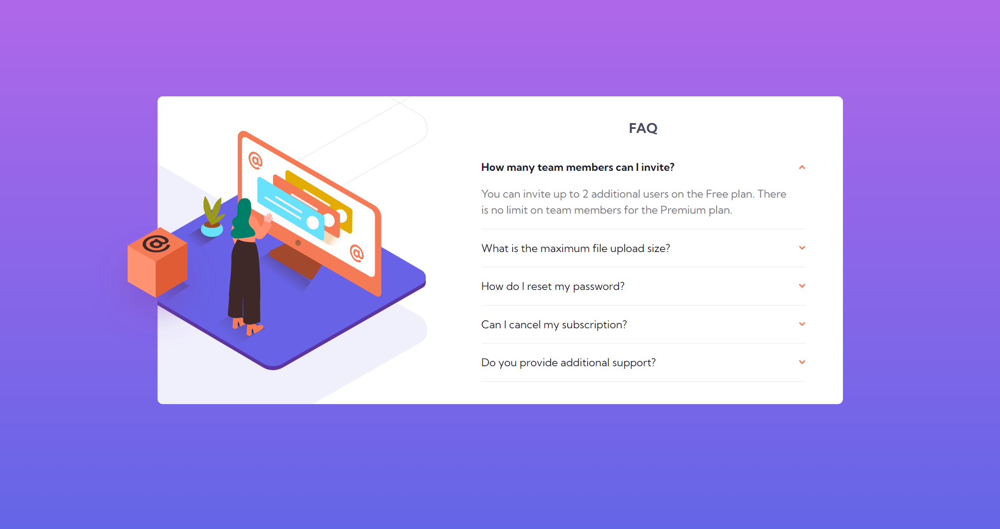

# Frontend Mentor - FAQ accordion card solution

This is a solution to the [FAQ accordion card challenge on Frontend Mentor](https://www.frontendmentor.io/challenges/faq-accordion-card-XlyjD0Oam). Frontend Mentor challenges help you improve your coding skills by building realistic projects.

## Table of contents

- [Overview](#overview)
  - [The challenge](#the-challenge)
  - [Screenshot](#screenshot)
  - [Links](#links)
- [My process](#my-process)
  - [Built with](#built-with)
  - [Continued development](#continued-development)
- [Author](#author)

**Note: Delete this note and update the table of contents based on what sections you keep.**

## Overview

### The challenge

Users should be able to:

- View the optimal layout for the component depending on their device's screen size
- See hover states for all interactive elements on the page
- Hide/Show the answer to a question when the question is clicked
- **Bonus**: Complete the challenge without using JavaScript

### Screenshot

Mobile version

Desktop version

### Links

- Solution URL: [Github](https://github.com/ob2code/frontend-mentor/tree/main/faq-accordion-card-main)
- Live Site URL: [https://ob-faq-accordion-card.netlify.app/](https://ob-faq-accordion-card.netlify.app/)

## My process

### Built with

- Mobile-first workflow
- [Tailwind CSS](https://tailwindcss.com/) - A utility-first CSS framework
- Javascript

### What I learned

Accordion implement by myself.

### Continued development

Things to improve:

- Take **bonus** challenge
- Center vertically the main div.
- Fix position of "FAQ" when collapse/uncollapse questions.

## Author

- 💻Website [ob2code.netlify.app](https://ob2code.netlify.app/)
- 💪Frontend Mentor - [@ob2code](https://www.frontendmentor.io/profile/ob2code)
- 👨‍💻GitHub [@ob2code](https://github.com/ob2code)
- 🐤Twitter [@ob2code](https://twitter.com/ob2code)
