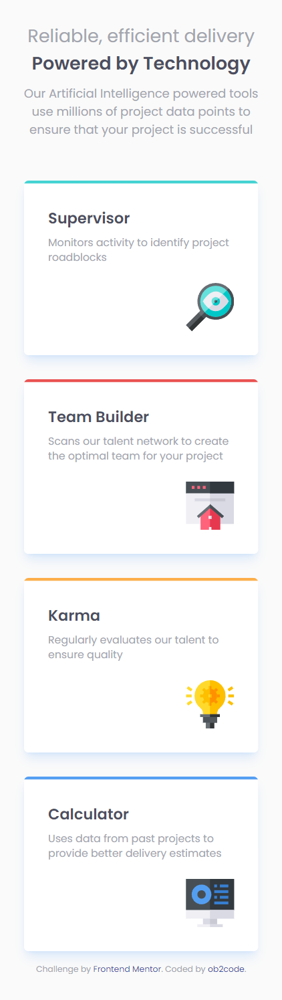

# Frontend Mentor - Four card feature section solution

This is a solution to the [Four card feature section challenge on Frontend Mentor](https://www.frontendmentor.io/challenges/four-card-feature-section-weK1eFYK). Frontend Mentor challenges help you improve your coding skills by building realistic projects.

## Table of contents

- [Overview](#overview)
  - [The challenge](#the-challenge)
  - [Screenshot](#screenshot)
  - [Links](#links)
- [My process](#my-process)
  - [Built with](#built-with)
  - [What I learned](#what-i-learned)
  - [Useful resources](#useful-resources)
- [Author](#author)

**Note: Delete this note and update the table of contents based on what sections you keep.**

## Overview

### The challenge

Users should be able to:

- View the optimal layout for the site depending on their device's screen size

### Screenshot

Mobile version



Desktop version


### Links

- Solution URL: [GitHub](https://github.com/ob2code/frontend-mentor/tree/main/four-card-feature-section-master)
- Live Site URL: [https://ob-four-card-feature.netlify.app/](https://ob-four-card-feature.netlify.app/)

## My process

### Built with

- Mobile-first workflow
- [Tailwind CSS](https://tailwindcss.com/) - A utility-first CSS framework

### What I learned

Helping to make a color tiny header on top:

```css
.card--container {
  @apply rounded-md overflow-hidden;
}
```

### Useful resources

- [overflow: hidden](http://jsfiddle.net/AAUbA/2/) - This helped me for making a tiny header inner a div.

## Author

- 💻Website [ob2code.netlify.app](https://ob2code.netlify.app/)
- 💪Frontend Mentor - [@ob2code](https://www.frontendmentor.io/profile/ob2code)
- 👨‍💻GitHub [@ob2code](https://github.com/ob2code)
- 🐤Twitter [@ob2code](https://twitter.com/ob2code)
