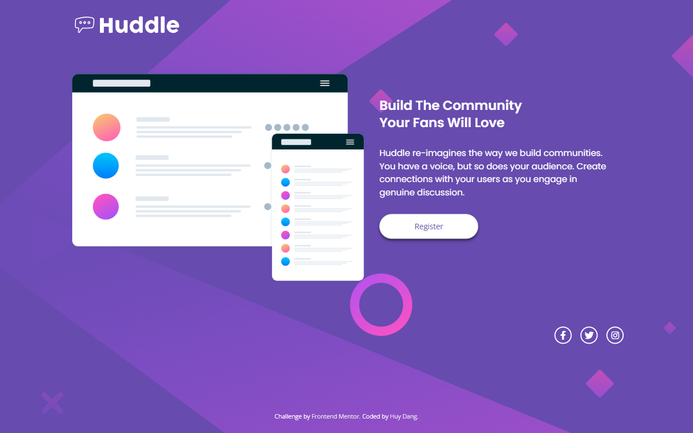

# Frontend Mentor - Huddle landing page with single introductory section solution

This is a solution to the [Huddle landing page with single introductory section challenge on Frontend Mentor](https://www.frontendmentor.io/challenges/huddle-landing-page-with-a-single-introductory-section-B_2Wvxgi0). Frontend Mentor challenges help you improve your coding skills by building realistic projects.

## Table of contents

- [Overview](#overview)
  - [The challenge](#the-challenge)
  - [Screenshot](#screenshot)
  - [Links](#links)
- [My process](#my-process)
  - [Built with](#built-with)
  - [What I learned](#what-i-learned)
- [Author](#author)

**Note: Delete this note and update the table of contents based on what sections you keep.**

## Overview

### The challenge

Users should be able to:

- View the optimal layout for the page depending on their device's screen size
- See hover states for all interactive elements on the page

### Screenshot

Mobile version


Desktop version



### Links

- Solution URL: [GitHub](https://github.com/ob2code/frontend-mentor/tree/main/huddle-landing-page-with-single-introductory)
- Live Site URL: [https://ob-huddle-landing-page.netlify.app/](https://ob-huddle-landing-page.netlify.app/)

## My process

### Built with

- Mobile-first workflow
- [Tailwind CSS](https://tailwindcss.com/) - A utility-first CSS framework
- [Animate.css](https://animate.style/) - For animation

### What I learned

Responsive background implement with TailwindCSS

```css
.resposivebg {
  background-image: url("/images/bg-mobile.svg");
  background-repeat: no-repeat;
  background-size: contain;
}

@media screen and (min-width: 1200px) {
  .resposivebg {
    background-image: url("/images/bg-desktop.svg");
    background-size: cover;
  }
}
```

## Author

- 💻Website [ob2code.netlify.app](https://ob2code.netlify.app/)
- 💪Frontend Mentor - [@ob2code](https://www.frontendmentor.io/profile/ob2code)
- 👨‍💻GitHub [@ob2code](https://github.com/ob2code)
- 🐤Twitter [@ob2code](https://twitter.com/ob2code)

## Acknowledgments

This is where you can give a hat tip to anyone who helped you out on this project. Perhaps you worked in a team or got some inspiration from someone else's solution. This is the perfect place to give them some credit.
