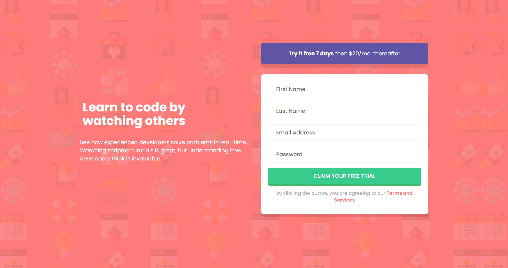

# Frontend Mentor - Intro component with sign up form solution

This is a solution to the [Intro component with sign up form challenge on Frontend Mentor](https://www.frontendmentor.io/challenges/intro-component-with-signup-form-5cf91bd49edda32581d28fd1). Frontend Mentor challenges help you improve your coding skills by building realistic projects.

## Table of contents

- [Overview](#overview)
  - [The challenge](#the-challenge)
  - [Screenshot](#screenshot)
  - [Links](#links)
- [My process](#my-process)
  - [Built with](#built-with)
  - [Useful resources](#useful-resources)
- [Author](#author)

**Note: Delete this note and update the table of contents based on what sections you keep.**

## Overview

### The challenge

Users should be able to:

- View the optimal layout for the site depending on their device's screen size
- See hover states for all interactive elements on the page
- Receive an error message when the `form` is submitted if:
  - Any `input` field is empty. The message for this error should say _"[Field Name] cannot be empty"_
  - The email address is not formatted correctly (i.e. a correct email address should have this structure: `name@host.tld`). The message for this error should say _"Looks like this is not an email"_

### Screenshot

Mobile version

Desktop version

### Links

- Solution URL: [GitHub](https://github.com/ob2code/frontend-mentor/tree/main/intro-with-signup-form)
- Live Site URL: [https://intro-with-signup-form-sigma.vercel.app/](https://intro-with-signup-form-sigma.vercel.app/)

## My process

### Built with

- Mobile-first workflow
- [Svelte](https://svelte.dev/) - Svelte web framework
- [Tailwind CSS](https://tailwindcss.com/) - A utility-first CSS framework

### Useful resources

- [JavaScript Regular Expression Email Validation](https://stackoverflow.com/questions/940577/javascript-regular-expression-email-validation/3613106#3613106) - This helped me for validate email. I really liked this pattern and will use it going forward.

## Author

- 💻Website [ob2code.netlify.app](https://ob2code.netlify.app/)
- 💪Frontend Mentor - [@ob2code](https://www.frontendmentor.io/profile/ob2code)
- 👨‍💻GitHub [@ob2code](https://github.com/ob2code)
- 🐤Twitter [@ob2code](https://twitter.com/ob2code)
